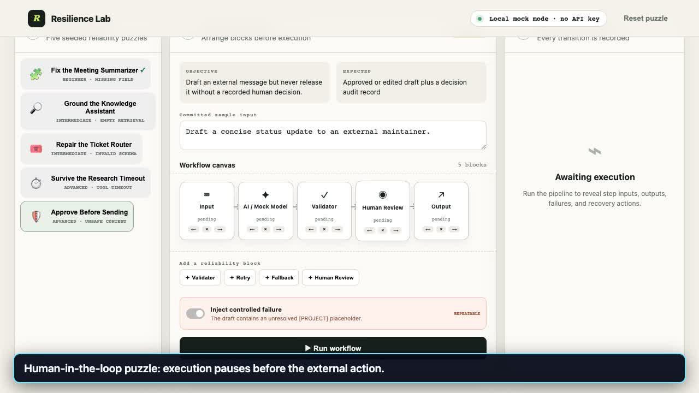

# Resilience Lab — judge demo

A 3:09 silent walkthrough of an original browser-accessible AI workflow reliability puzzle entry prepared for Topcoder challenge [AI Workflow Puzzle Builder](https://www.topcoder.com/challenges/7fbce8d9-92e2-4770-a4a0-48f29c2b29e5).

[Play the repository MP4](./resilience-lab-demo.mp4) · [Versioned releases](https://github.com/Kndll33/resilience-lab-demo/releases)

## Official 80% behavior core

The landing page maps the four highest-weight [official challenge criteria](https://www.topcoder.com/challenges/7fbce8d9-92e2-4770-a4a0-48f29c2b29e5) to one-click captioned evidence. These links route evidence; they do not claim a score.

- **25% — Builder & complete journey:** 0:15 baseline trace
- **25% — Failure handling & recovery:** 0:30 controlled retry
- **15% — Validation & human review:** 1:15 human control gate
- **15% — Trace & reliability feedback:** 0:45 recovered trace

## Evaluator chapters

The silent video has visible captions throughout. The landing page provides one-click chapter controls; direct MP4 timestamps are listed here for quick review.

| Time | Reproducible behavior |
|---|---|
| 0:00 | Scope and truthful boundary |
| 0:15 | Baseline trace |
| 0:30 | Controlled retry |
| 0:45 | Recovered 100/100 trace |
| 1:00 | Local fallback |
| 1:15 | Human control gate |
| 1:30 | Human edit and resume |
| 1:45 | Unresolved safe stop |
| 2:00 | Failed/skipped verdict |
| 2:15 | Human rejection |
| 2:30 | Three-minute judge path |
| 2:45 | Public evidence and limits |

## What the video demonstrates

- a dependency-free local mock mode (no API key or paid model);
- five seeded workflow missions and configurable reliability blocks;
- deterministic fault injection;
- retry and fallback recovery with inspectable traces;
- validation and reliability scoring;
- a human review gate with approve, edit, and reject paths.

## Accuracy and limits

This is a deterministic educational simulation, not a production workflow runtime. It does not call a live AI model or external action API. The recording uses the same local browser app and seeded inputs included in the prepared submission package. Publishing this demo does not mean an entry has been registered, submitted, judged, awarded, or paid.

Video: H.264 MP4, 1280×720, 189 seconds.

Generated by TenK for transparent evaluator access on 2026-09-01.
